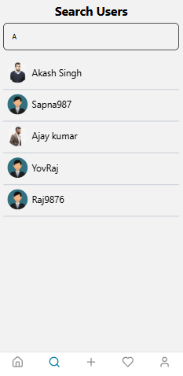

# Threads Clone

### Overview
*Threads Clone* is a mobile application built with Expo and React Native, offering features like real-time activity feeds, follow/unfollow functionality, and public/private profile screens. It includes notifications for request, accept, and reject actions. The backend is developed using Node.js and MongoDB, ensuring seamless communication between the frontend and backend. JWT is used for secure user authentication and session management.

---

## Technologies Used  

- **Frontend:**  
  - React Native Expo  
  - Tailwind CSS

- **Backend:**  
  - Node.js  
  - Express.js  

- **Database:**  
  - MongoDB  

---

## Installation and Setup

### 📌 API Configuration Guide

🛠 **Environment Variables Setup**  
Before running the project, set up the required environment variables in a `.env` file inside the API folder.

---

1️⃣ Set Your MongoDB URL 
Go to your MongoDB 
```bash
DB=""
```
2️⃣ Set the Server Port
 ```bash
PORT=3000
```
3️⃣ Email Configuration
Go to your email provider and generate a user and password, then add them:
 ```bash
USER=""
PASS=""
```
4️⃣ Cloudinary Configuration
Go to Cloudinary and set up your credentials:
 ```bash
CLOUDINARY_CLOUD_NAME=""
CLOUDINARY_API_KEY=""
CLOUDINARY_API_SECRET=""
```

🚀 Running the API
Once you've set up the .env file, start the API using:
 ```bash
npm install  # Install dependencies
npm start    # Run the server
```

### Frontend  
Install dependencies:  
   ```bash
   npm install
   npm start
   ```
### Backend (api) 
1. Navigate to the `api` folder.  
2. Install dependencies:  
   ```bash
   npm install
   npm start
    ```

#### MD_dummy_data
After all, if you want a dummy data set, go to the `MD_dummy_data folder`, then simply copy and directly insert the data into MongoDB for the users and posts collection.


##Preview
### You can view the preview of the app here:





